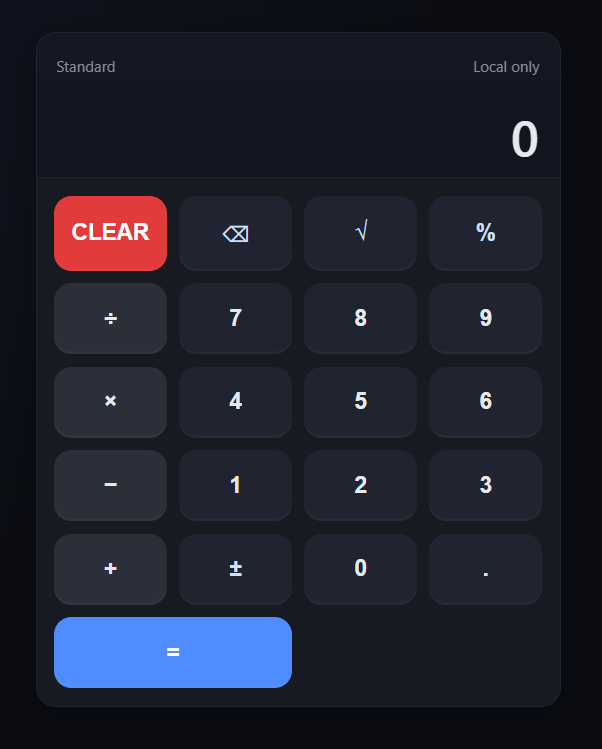

# Modern Calculator

A modern calculator built with **HTML, CSS, and JavaScript**.  
This project is designed to be **mobile-friendly**, responsive, and easy to use on both desktop and touch devices.  

---

## ✨ Features
- Basic operations: **addition, subtraction, multiplication, division**
- Extra functions: **percent (%), plus/minus (±), square root (√)**
- **Backspace (⌫)** and **Clear (AC)** buttons
- **Keyboard support** (numbers, operators, Enter, Backspace, Esc)
- **Formatted numbers** (with thousands separator)
- **Responsive design** for mobile and desktop

---

## 🛠️ Technologies
- **HTML5** – structure  
- **CSS3** – custom styling with variables and responsive design  
- **JavaScript (ES6)** – calculator logic  

---

## 🚀 Live Demo
👉 [View on GitHub Pages](https://s4rt4.github.io/kalkulator2)

## 📷 Preview


## 🚀 How to Use
1. Clone the repository:
   ```bash
   git clone https://github.com/s4rt4/kalkulator2.git
   
